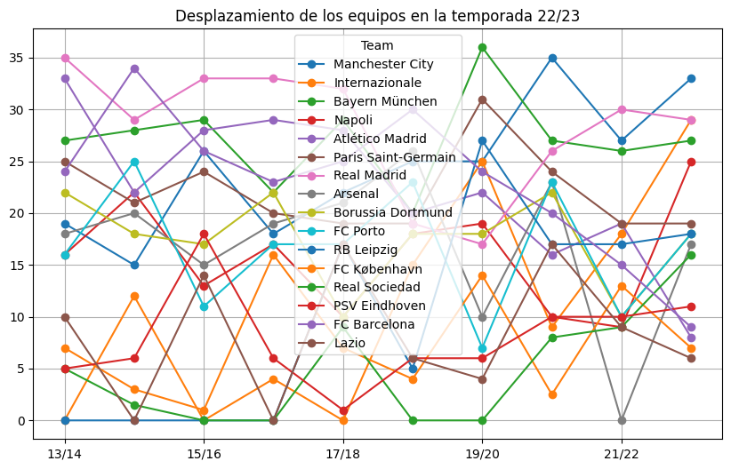
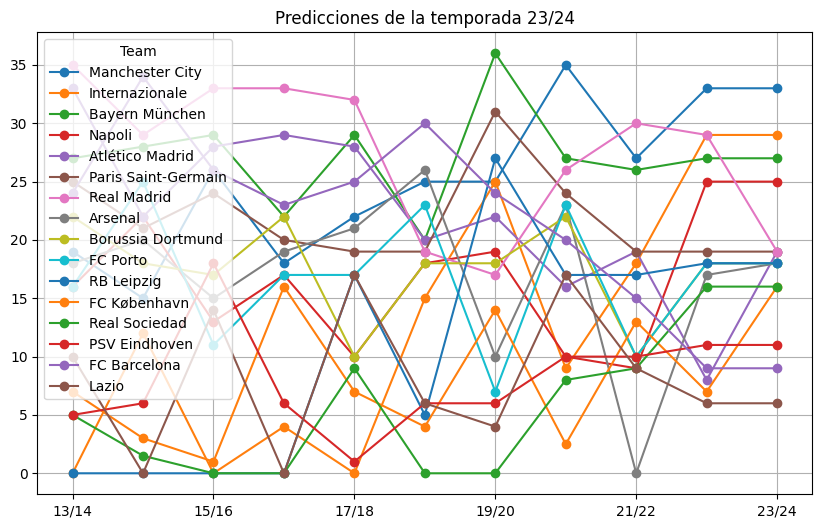

# UEFA_CL_Predicciones

El enlace al repositorio de GitHub es el siguiente: [https://github.com/MiguelGG03/UEFA_CL_Predicciones.git](https://github.com/MiguelGG03/UEFA_CL_Predicciones.git)

## Datos

Los datos que he utilizado para poder intentar predecir los resultados de esta edición de la champions league son los siguientes:

## Predicciones

Las predicciones que he obtenido en base a un árbol de regresión para la nueva edición de la champions ``2023/2024`` son los siguientes:

| Team                  | 23/24 |
|-----------------------|-------|
|Manchester City	    |33.0   |
|Internazionale	        |29.0   |
|Bayern München	        |27.0   |
|Napoli	                |25.0   |
|Atlético Madrid	    |19.0   |
|Paris Saint-Germain	|19.0   |
|Real Madrid	        |19.0   |
|Arsenal	            |18.0   |
|Borussia Dortmund	    |18.0   |
|FC Porto	            |18.0   |
|RB Leipzig	            |18.0   |
|FC København       	|16.0   |
|Real Sociedad      	|16.0   |
|PSV Eindhoven      	|11.0   |
|FC Barcelona	        |9.0    |
|Lazio	                |6.0    |

## Análisis de los resultados obtenidos

Hay un problema dentro de las predicciones que he recibido con el árbol de decisión.

- Estos son los datos obtenidos sin la predicción: 

- Estos son los datos obtenidos con la predicción: 

Es evidente que las predicciones no son my buenas, porque son casi una réplica identica de los resultados obtenidos en la última edición de la champions. Por lo que sería un acierto proporcionar más datos al modelo, como: partidos de ediciones anteriores, conocimiento sobre los resultados presentes y un cuadro de cuartos de finales.

Es importante tener en cuenta que los datos no reflejan la situación actual futbolística, ya que el impacto de los jugadores sobre el equipo en el que están. Porque no es relevante saber que Cristiano Ronaldo ganó tres Champions seguidas en el Real Madrid hace 8 años, sabiendo que ni Cristiano sigue en el Madrid, ni es igual de influyente que era hace 8 años.

Para medir la relevancia que tiene un jugador, bastaría con medir sus estadísticas de la última temporada, esto sería una barbaridad puesto que la medida no es de un único equipo, sino todos los jugadores de los 16 equipos que siguen `"en pie"`.

Aparte, podríamos usar otros modelos de entrenamiento que funciones mejor para datos no discretos, como un "Random Forest", "Vectores de Soporte (SVM)" o " Gradiente Boosting como XGBoost, LightGBM, y CatBoost".

## Lección de la entrega

La lección que se saca en claro de esta entrega, es que el sesgo es una parte __fundamental__ dentro de el entrenamiento de modelos de inteligencia artificial, porque en los datos que he utilizado, no se miden cosas cruciales para realmente poder predecir quién ganará la champions.
